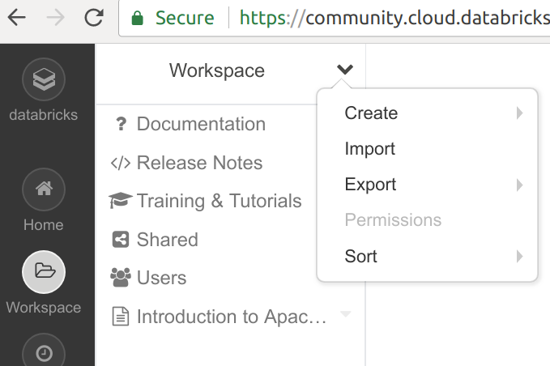
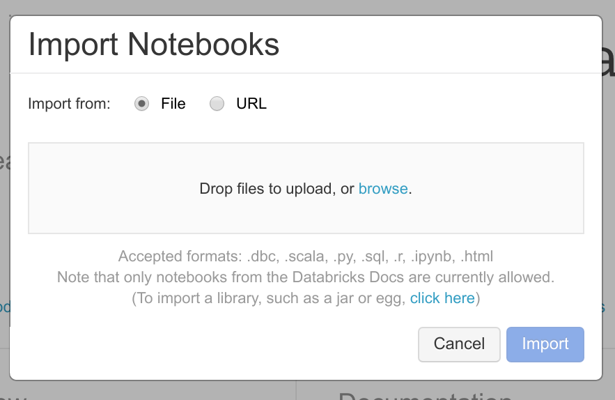

# Big Data

**The intro notebook being run notebook presented here (not interactive)**: [HTML version of Intro Notebook](https://databricks-prod-cloudfront.cloud.databricks.com/public/4027ec902e239c93eaaa8714f173bcfc/634487280343792/1515220293376006/7985151593079549/latest.html)

-----------

We will work with Databricks Community platform in order to get to know the basics of Spark and big data processing / querying.

Register a free **Databricks Community account** here (press *Get Started* under *Community Edition*):
### [https://databricks.com/try](https://databricks.com/try)

The notebooks we are going to work with are uploaded into this folder. Download them to your local computer and then upload them to Databricks, by following the steps in the pictures below:

1. Press the down arrow when you have opened your `Workspace` and press **`Import`**.

2. Import the notebooks as files, they all have extension `.ipynb`

.

This is also a good introductory tutorial: [Intro to pyspark on Databricks](https://databricks-prod-cloudfront.cloud.databricks.com/public/4027ec902e239c93eaaa8714f173bcfc/8383153137003323/3949934397605030/1191695088252320/latest.html)
