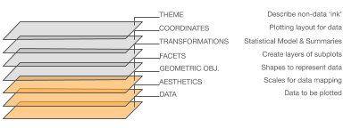

     
     
# **@Plaksha:**   Introduction to Data Types, Data Visualization &amp; Visual Storytelling.

**Author list:** [Elias Castro Hernandez](https://www.linkedin.com/in/ehcastroh/) and [Alexander Fred-Ojala](https://www.linkedin.com/in/alexanderfo/) 

**Learning Goal(s):** The goal of this series of notebooks is to provide users with the necessary foundations for building and understanding current state of the art visualizations. An additional aim is to provide users with an understanding of both the theory and techniques of various visualization paradigms. Finally, this series of notebooks seeks to provide sufficient knowledge to users so that they may build & evaluate various visualization systems, read & discuss visualization literature, and successfully convey visual information.

### **About**

The following notebooks were created for Plaksha University. They are intended to provide a rapid introduction to common python visualization libraries, as well as introduce the user to more advanced visualization libraries and engines. The notebooks are structured into 2 parts.

  - Visualization Intro 1 -- Fundamental overview of data classification theory and how it relates to visualizations in practice.
  - Visualization Intro 2 -- Explores various plotting libraries, introduces more advanced visualization libraries and state-of-the-art visualization paradigms.

 

#### **I. Introduction to Data Types and Visualization Principles.**

     
    0) Introduction to RISE: Executable Slide Deck.
    1) Principles of Visualization: Data Types and Their Connection to Visualizations.
    2) Overview of Matplotlib
    3) Overview of Seaborn
    I) Additional References and Resources
    II) Visualization Galleries
    
 

#### **II. Comparative Visualizations, and Advanced Visualizations Using Plotly and Altair.**

     
    0) Brief Overview of Data Types.
    1) A Brief Tour of Python's Entry-Level Visualization Landscape.
    2) Two Dynamic Visualization Libraries, Using Real-World Data. 
    3) One Plot: Static, Dynamic, and Interactive.
    I) Additional References and Resources
    
    

